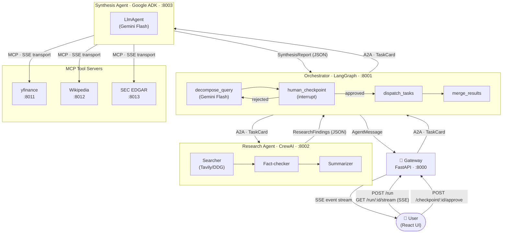

# AgentMesh — Cross-Framework Intelligence Network

Three AI agents (LangGraph + CrewAI + Google ADK), each in its own Docker service, collaborating on deep research tasks via MCP and A2A protocols.

---

## Architecture



**Protocol legend**
- **A2A** (Google's Agent-to-Agent): JSON-RPC 2.0 over HTTP. Used for cross-agent task delegation. Carries `TaskCard` envelopes with `task_id`, `context_id`, and `retry_count`.
- **MCP** (Anthropic's Model Context Protocol): SSE transport. Used for tool calls inside the synthesis agent. Each tool is a swappable standalone server.

---

## Why This Is Hard

- **Cross-framework agent communication** — LangGraph, CrewAI, and Google ADK have completely different execution models. Getting them to interoperate without shared Python state requires a proper protocol layer (A2A) and a shared Pydantic contract (`shared/models.py` mounted as a Docker volume into every container).

- **Protocol-level A2A and MCP implementation** — Both protocols are implemented from scratch: a JSON-RPC 2.0 A2A client/server (`shared/a2a_client.py`, `shared/a2a_server.py`) and three standalone MCP servers using SSE transport. This isn't LangChain tool wrapping — it's the actual wire protocol.

- **Real human-in-the-loop with async resumption** — The LangGraph graph uses `interrupt()` to genuinely suspend mid-execution. The graph is checkpointed to `MemorySaver`, an `asyncio.Event` blocks the runner, and the graph resumes in a separate HTTP request via `Command(resume=...)`. No polling loop, no sleep — a real async pause across HTTP boundaries.

- **Partial failure handling at the orchestrator level** — If the research agent fails after one retry, the orchestrator doesn't crash — it builds a `PartialResult` from whatever completed and still returns useful output. If synthesis fails independently, the raw research findings are surfaced. Every failure path is typed and logged.

---

## Tech Stack

| Service | Framework | LLM | Port |
|---|---|---|---|
| Gateway | FastAPI + sse-starlette | — | 8000 |
| Orchestrator | LangGraph (StateGraph) | Gemini Flash | 8001 |
| Research Agent | CrewAI (3-member crew) | Gemini Flash via LiteLLM | 8002 |
| Synthesis Agent | Google ADK (LlmAgent) | Gemini Flash | 8003 |
| YFinance MCP Tool | FastAPI + MCP SDK | — | 8011 |
| Wikipedia MCP Tool | FastAPI + MCP SDK | — | 8012 |
| SEC EDGAR MCP Tool | FastAPI + MCP SDK | — | 8013 |
| Frontend | React + TypeScript | — | 3000 |

All LLM calls use **Gemini Flash** (free tier via Google AI Studio). No paid OpenAI or Anthropic API calls are required to run this project.

---

## Quick Start

```bash
git clone https://github.com/Jeet-51/agentmesh.git && cd agentmesh
cp .env.example .env          # add your GOOGLE_API_KEY — everything else is optional
docker compose up --build
```

Open [http://localhost:3000](http://localhost:3000).

> **Minimum required:** `GOOGLE_API_KEY` (free at [aistudio.google.com](https://aistudio.google.com)).
> Set `TAVILY_API_KEY` for better web search quality; the research agent falls back to DuckDuckGo without it.

---

## How It Works

**Example query: "What is the outlook for Nvidia in 2026?"**

**1 — Decomposition** `(~3s)`
The orchestrator sends the query to Gemini Flash, which splits it into three focused sub-tasks:
- *Nvidia's AI chip market position and competitive landscape*
- *Nvidia's financial health and recent earnings trajectory*
- *Key risks and regulatory factors for 2026*

**2 — Human checkpoint** `(your turn)`
The React UI displays the three sub-tasks and asks: *"Approve, edit, or reject?"*
The LangGraph graph is genuinely paused — checkpointed in memory, waiting on an `asyncio.Event`. Nothing runs until you click Approve.

**3 — Research dispatch** `(~45s)`
The orchestrator sends one A2A `TaskCard` per sub-task to the CrewAI research agent.
Inside CrewAI, three agents run sequentially for each task:
- **Searcher** runs Tavily web searches and collects sources with URLs.
- **Fact-checker** cross-references claims against multiple sources, sets `fact_check_passed`.
- **Summarizer** produces a structured JSON finding with `confidence_score`.

Each `ResearchFindings` result is returned via A2A and collected by the orchestrator.

**4 — Synthesis** `(~20s)`
The orchestrator forwards all three `ResearchFindings` to the Google ADK synthesis agent in a single A2A call. The ADK agent (Gemini Flash) has three MCP tools available:
- Calls `get_stock_price("NVDA")` and `get_financials("NVDA")` → live price, P/E, margins.
- Calls `search("Nvidia 2026 outlook")` on Wikipedia → contextual background.
- Calls `search_filings("NVIDIA", "10-K")` on SEC EDGAR → most recent annual report metadata.

Every tool call is recorded and becomes a `Citation` in the final report.

**5 — Final report**
The synthesis agent produces a `SynthesisReport` with:
- A 400-800 word narrative with inline `[yfinance]`, `[wikipedia]`, `[edgar]` citations
- Per-section confidence scores
- Recommended actions

The orchestrator merges it into the final `OrchestratorState` and the gateway delivers it to the frontend via SSE.

---

## Project Structure

```
agentmesh/
├── shared/                     # Pydantic models + A2A protocol (mounted into every container)
│   ├── models.py               # All typed data contracts (TaskCard, AgentMessage, SubTask, ...)
│   ├── a2a_client.py           # Reusable async A2A HTTP client
│   ├── a2a_server.py           # TaskHandler ABC + create_a2a_app() factory
│   └── a2a_types.py            # JSON-RPC 2.0 wire types
│
├── agents/
│   ├── orchestrator/           # LangGraph StateGraph
│   │   ├── graph.py            # StateGraph topology + conditional edges
│   │   ├── nodes.py            # decompose_query, human_checkpoint, dispatch_tasks, merge_results
│   │   ├── checkpoints.py      # CheckpointStore (asyncio.Event) + /checkpoint HTTP router
│   │   └── a2a_server.py       # A2A receiver + graph runner + /run/:id REST endpoint
│   │
│   ├── research/               # CrewAI 3-member crew
│   │   ├── crew.py             # Searcher, Fact-checker, Summarizer agents + output parsing
│   │   └── a2a_server.py       # A2A receiver — runs crew in asyncio.to_thread()
│   │
│   └── synthesis/              # Google ADK agent
│       ├── agent.py            # SynthesisAgent — MCPToolset + ADK runner + output parsing
│       ├── a2a_server.py       # A2A receiver — lifespan initialises agent once
│       └── mcp_tools/
│           ├── yfinance_tool.py    # MCP server :8011 — get_stock_price, get_financials
│           ├── wikipedia_tool.py   # MCP server :8012 — search, get_summary
│           └── edgar_tool.py       # MCP server :8013 — search_filings, get_10k
│
├── gateway/
│   └── main.py                 # Entry point: SSE stream, run/checkpoint proxy, CORS
│
├── frontend/
│   └── src/
│       ├── App.tsx
│       └── components/
│           ├── QueryInput.tsx      # Query form + sub-task approval UI
│           ├── AgentTrace.tsx      # Live SSE event feed with protocol labels
│           └── ReportView.tsx      # Final report with citations + confidence scores
│
├── docker-compose.yml          # 8 services, health checks, startup dependency chain
└── .env.example
```

---

## Key Design Decisions

**1 — `asyncio.Event` for the human-in-the-loop pause**
LangGraph's `interrupt()` suspends the graph and raises `GraphInterrupt`. The graph runner catches it, stores the interrupt payload in `CheckpointStore`, and calls `await event.wait()`. The FastAPI `/checkpoint/{run_id}` POST handler calls `event.set()`. The runner wakes up in the same async task — no polling, no database, no process restart. This works correctly across HTTP request boundaries because FastAPI runs everything in a single async event loop.

**2 — Long polling over WebSockets for the SSE stream**
The gateway polls the orchestrator every 2.5 seconds and fans out to all connected SSE clients via per-run `asyncio.Queue` lists. WebSockets would require the orchestrator to push events, which would couple its internal LangGraph node execution to an external connection. Polling decouples them cleanly: the orchestrator is a pure A2A receiver, the gateway owns the frontend protocol.

**3 — HTTP 200 for A2A error responses**
`shared/a2a_server.py` returns HTTP 200 with a JSON-RPC 2.0 error body for application-level failures, not HTTP 4xx/5xx. This follows the JSON-RPC spec: HTTP errors mean transport failure (network, auth), not agent failure. The orchestrator's `A2AClient` distinguishes them — `httpx.HTTPStatusError` for transport, `A2AError` parsed from a 200 body for agent errors.

**4 — MCPToolset per server, not one shared toolset**
Each MCP tool server (yfinance, Wikipedia, EDGAR) gets its own `MCPToolset` instance with an independent SSE connection. If one server is unreachable at startup, only that toolset fails — the synthesis agent continues with the remaining two. A single shared toolset would make all tools fail together.

**5 — Fire-and-forget orchestrator dispatch**
`POST /a2a` on the orchestrator returns immediately with `{run_id, status: "awaiting_human"}` and starts the graph as `asyncio.create_task()`. This prevents the gateway's HTTP timeout from killing a 90-second research run. The gateway polls `/run/{run_id}` independently. The tradeoff: if the orchestrator process dies mid-run, the run is lost (acceptable for a portfolio project; use a persistent checkpointer like `AsyncSqliteSaver` in production).

---

## Environment Variables

| Variable | Required | Default | Description |
|---|---|---|---|
| `GOOGLE_API_KEY` | ✅ Yes | — | Gemini Flash API key (get free at aistudio.google.com) |
| `ANTHROPIC_API_KEY` | No | — | Not used by default (all agents use Gemini Flash) |
| `TAVILY_API_KEY` | No | — | Tavily web search. Falls back to DuckDuckGo if absent |
| `LANGSMITH_API_KEY` | No | — | LangSmith tracing for LangGraph runs |
| `ORCHESTRATOR_URL` | No | `http://orchestrator:8001` | Orchestrator A2A endpoint |
| `RESEARCH_AGENT_URL` | No | `http://research:8002` | Research agent A2A endpoint |
| `SYNTHESIS_AGENT_URL` | No | `http://synthesis:8003` | Synthesis agent A2A endpoint |
| `YFINANCE_TOOL_URL` | No | `http://yfinance-tool:8011/sse` | YFinance MCP SSE endpoint |
| `WIKIPEDIA_TOOL_URL` | No | `http://wikipedia-tool:8012/sse` | Wikipedia MCP SSE endpoint |
| `EDGAR_TOOL_URL` | No | `http://edgar-tool:8013/sse` | SEC EDGAR MCP SSE endpoint |
| `LOG_FORMAT` | No | `console` | Set to `json` for structured Docker log output |
| `GATEWAY_POLL_INTERVAL` | No | `2.5` | Seconds between orchestrator status polls |
| `GATEWAY_SSE_KEEPALIVE` | No | `25.0` | SSE ping interval in seconds |

---

## License

MIT © 2025
