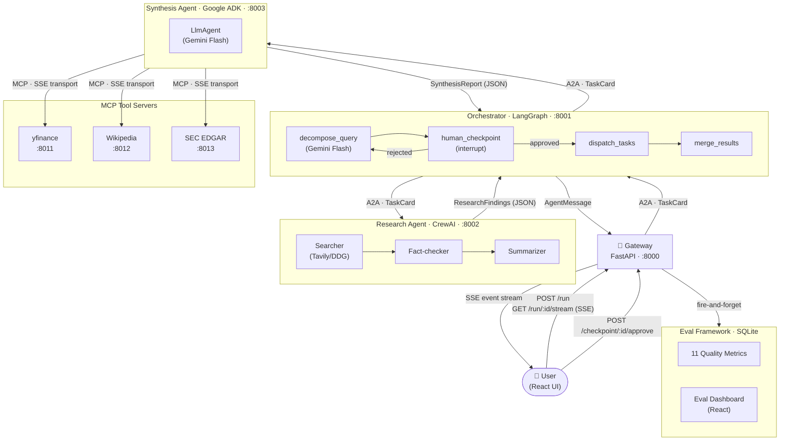

# AgentMesh — Cross-Framework Multi-Agent Research System

Three AI agents (LangGraph + CrewAI + Google ADK), each in its own Docker service, collaborating on deep research tasks via MCP and A2A protocols. Includes a built-from-scratch evaluation framework with 11 quality metrics scored on every report.

---

## Architecture



**Protocol legend**
- **A2A** (Google Agent-to-Agent): JSON-RPC 2.0 over HTTP. Used for cross-agent task delegation. Carries `TaskCard` envelopes with `task_id`, `context_id`, and `retry_count`.
- **MCP** (Anthropic Model Context Protocol): SSE transport. Used for tool calls inside the synthesis agent. Each tool is a swappable standalone server.

---

## Why This Is Hard

- **Cross-framework agent communication**: LangGraph, CrewAI, and Google ADK have completely different execution models. Getting them to interoperate without shared Python state requires a proper protocol layer (A2A) and a shared Pydantic contract (`shared/models.py` mounted as a Docker volume into every container).

- **Protocol-level A2A and MCP implementation**: Both protocols are implemented from scratch: a JSON-RPC 2.0 A2A client/server (`shared/a2a_client.py`, `shared/a2a_server.py`) and three standalone MCP servers using SSE transport. This is the actual wire protocol, not LangChain tool wrapping.

- **Real human-in-the-loop with async resumption**: The LangGraph graph uses `interrupt()` to genuinely suspend mid-execution. The graph is checkpointed to `MemorySaver`, an `asyncio.Event` blocks the runner, and the graph resumes in a separate HTTP request via `Command(resume=...)`. No polling loop, no sleep -- a real async pause across HTTP boundaries.

- **Partial failure handling at the orchestrator level**: If the research agent fails after one retry, the orchestrator does not crash -- it builds a `PartialResult` from whatever completed and still returns useful output. If synthesis fails independently, the raw research findings are surfaced. Every failure path is typed and logged.

- **Built-from-scratch evaluation framework**: 11 quality metrics (hallucination, quantitative accuracy, freshness, diversity, entity coverage, narrative length, source credibility, fictional premise detection, answer relevance, tool activation, citation density) scored automatically on every report and stored in SQLite. Includes a live React dashboard.

---

## Tech Stack

| Service | Framework | LLM | Port |
|---|---|---|---|
| Gateway | FastAPI + sse-starlette | -- | 8000 |
| Orchestrator | LangGraph (StateGraph) | Gemini Flash | 8001 |
| Research Agent | CrewAI (3-member crew) | Gemini Flash via LiteLLM | 8002 |
| Synthesis Agent | Google ADK (LlmAgent) | Gemini Flash | 8003 |
| YFinance MCP Tool | FastAPI + MCP SDK | -- | 8011 |
| Wikipedia MCP Tool | FastAPI + MCP SDK | -- | 8012 |
| SEC EDGAR MCP Tool | FastAPI + MCP SDK | -- | 8013 |
| Frontend | React + TypeScript + Vite | -- | 3000 |

All LLM calls use **Gemini Flash** (free tier via Google AI Studio). No paid OpenAI or Anthropic API calls are required to run this project.

---

## Quick Start

```bash
git clone https://github.com/Jeet-51/agentmesh.git && cd agentmesh
cp .env.example .env          # add your GOOGLE_API_KEY — everything else is optional
docker compose up --build
```

Open [http://localhost:3000](http://localhost:3000).

**Minimum required:** `GOOGLE_API_KEY` (free at [aistudio.google.com](https://aistudio.google.com)).

Optional keys that improve output quality:
- `TAVILY_API_KEY`: better web search (falls back to DuckDuckGo without it)
- `NEWS_API_KEY`: recent news articles in reports (newsapi.org free tier)
- `FINNHUB_API_KEY`: analyst ratings and financial news (finnhub.io free tier)

---

## How It Works

**Example query: "What is the outlook for Nvidia in 2026?"**

**1 — Decomposition** (~3s)
The orchestrator sends the query to Gemini Flash, which splits it into focused sub-tasks:
- *Nvidia's AI chip market position and competitive landscape*
- *Nvidia's financial health and recent earnings trajectory*
- *Key risks and regulatory factors for 2026*

**2 — Human checkpoint** (your turn)
The React UI displays the sub-tasks and asks: "Approve, edit, or reject?"
The LangGraph graph is genuinely paused -- checkpointed in memory, waiting on an `asyncio.Event`. Nothing runs until you click Approve.

**3 — Research dispatch** (~45s)
The orchestrator sends one A2A `TaskCard` per sub-task to the CrewAI research agent.
Inside CrewAI, three agents run sequentially for each task:
- **Searcher** runs Tavily web searches and collects sources with URLs.
- **Fact-checker** cross-references claims against multiple sources, sets `fact_check_passed`.
- **Summarizer** produces a structured JSON finding with `confidence_score`.

Each `ResearchFindings` result is returned via A2A and collected by the orchestrator.

**4 — Synthesis** (~20s)
The orchestrator forwards all `ResearchFindings` to the Google ADK synthesis agent in a single A2A call. Before calling the LLM, the agent runs parallel enrichment:
- **Wikipedia REST API**: company background and overview.
- **SEC EDGAR EFTS API**: most recent 10-K filing metadata.
- **Finnhub API**: analyst consensus ratings and recent news headlines.
- **NewsAPI**: recent articles related to the topic.

The ADK agent (Gemini Flash) then calls the yfinance MCP tool for live stock prices and financial data. Every tool call is recorded and becomes a `Citation` in the final report.

**5 — Evaluation** (fire-and-forget, ~2s)
Once the report is complete, the gateway scores it against 11 quality metrics in a background task and writes results to SQLite. The Eval Dashboard updates automatically every 30 seconds.

**6 — Final report**
The synthesis agent produces a `SynthesisReport` with a narrative, inline citations, confidence scores, and recommended actions. The orchestrator merges it and the gateway delivers it to the frontend via SSE.

---

## Evaluation Framework

Every completed report is automatically scored across 11 metrics. Open the **Evals** button in the top-right corner of the UI to see the live dashboard.

### Tier 1 — Factual Accuracy

| Metric | What it measures |
|---|---|
| **Hallucination** | Citation count relative to paragraph count. 1.0 means every paragraph has a source. |
| **Quantitative** | Numbers in the narrative matched against yfinance ground-truth and user-provided values within 15% tolerance. |
| **Freshness** | Average age of dated citations. 1.0 means very recent sources. |
| **Diversity** | Unique source domains divided by total citations. 1.0 means every citation is from a different site. |
| **Entity Coverage** | Key nouns from the query found in the narrative. 1.0 means the report fully addresses the question. |

### Tier 2 -- Quality

| Metric | What it measures |
|---|---|
| **Narrative Length** | Word count in the ideal 400-900 range plus all 5 expected section headers present. |
| **Source Credibility** | Weighted domain authority. SEC/Gov=1.0, Reuters/Bloomberg/Finnhub=0.8, Yahoo/CNBC=0.65, Wikipedia=0.5, unknown=0.3. |
| **Fictional Premise** | Rewards correct hedging ("reportedly", "analysts expect") for uncertain claims. Penalises fabricated figures. |
| **Answer Relevance** | Whether the conclusion directly answers the specific question asked, with exact figures for comparison queries. |

### Tier 3 -- Diagnostics

| Metric | What it measures |
|---|---|
| **Tool Activation** | Fraction of 5 tools (yfinance, newsapi, wikipedia, edgar, finnhub) that contributed citations. |
| **Citation Density** | Citations per 200 words. 1.0 means the report is well-backed throughout. |
| **Conf. Calibration** | Gap between the agent's self-reported confidence and the actual eval overall. Not included in the overall score. |

### User-Provided Value (UPV) Enforcement

If you include specific figures in your query (e.g. "revenue ($111.2B)"), the synthesis agent treats those as absolute ground truth. They override any contradicting data from external sources. If a retrieved source differs by more than 2%, the conflict is moved to a "Contradictory Market Data" footnote in the report instead of polluting the main body.

---

## Project Structure

```
agentmesh/
├── shared/                         # Pydantic models + A2A protocol (mounted into every container)
│   ├── models.py                   # All typed data contracts (TaskCard, AgentMessage, SubTask, ...)
│   ├── a2a_client.py               # Reusable async A2A HTTP client
│   ├── a2a_server.py               # TaskHandler ABC + create_a2a_app() factory
│   └── a2a_types.py                # JSON-RPC 2.0 wire types
│
├── agents/
│   ├── orchestrator/               # LangGraph StateGraph
│   │   ├── graph.py                # StateGraph topology + conditional edges
│   │   ├── nodes.py                # decompose_query, human_checkpoint, dispatch_tasks, merge_results
│   │   ├── checkpoints.py          # CheckpointStore (asyncio.Event) + /checkpoint HTTP router
│   │   └── a2a_server.py           # A2A receiver + graph runner + /run/:id REST endpoint
│   │
│   ├── research/                   # CrewAI 3-member crew
│   │   ├── crew.py                 # Searcher, Fact-checker, Summarizer agents + output parsing
│   │   └── a2a_server.py           # A2A receiver — runs crew in asyncio.to_thread()
│   │
│   └── synthesis/                  # Google ADK agent
│       ├── agent.py                # SynthesisAgent — enrichment, UPV extraction, MCP tools, prompt
│       ├── a2a_server.py           # A2A receiver — lifespan initialises agent once
│       └── mcp_tools/
│           ├── yfinance_tool.py    # MCP server :8011 — get_stock_price, get_financials
│           ├── wikipedia_tool.py   # MCP server :8012 — search, get_summary
│           └── edgar_tool.py       # MCP server :8013 — search_filings, get_10k
│
├── evals/                          # Evaluation framework (volume-mounted into gateway)
│   ├── eval_runner.py              # Orchestrates all metrics and writes to SQLite
│   ├── dashboard.py                # CLI dashboard (python evals/dashboard.py)
│   ├── storage/
│   │   └── eval_db.py              # SQLite schema: reports + eval_scores tables
│   └── metrics/
│       ├── hallucination.py
│       ├── quantitative.py         # 15% tolerance + UPV ground-truth injection
│       ├── freshness.py
│       ├── diversity.py
│       ├── entity_coverage.py
│       ├── narrative_length.py
│       ├── source_credibility.py   # Tiered domain authority scoring
│       ├── fictional_premise.py    # Hedging detection + fabrication penalty
│       ├── answer_relevance.py     # Conclusion coverage of query intent
│       ├── tool_activation.py
│       ├── citation_density.py
│       └── confidence_calibration.py
│
├── gateway/
│   └── main.py                     # SSE stream, run/checkpoint proxy, /evals/scores endpoint
│
├── frontend/
│   └── src/
│       ├── App.tsx
│       └── components/
│           ├── QueryInput.tsx          # Query form + sub-task approval UI
│           ├── AgentTrace.tsx          # Live SSE event feed with protocol labels
│           ├── ReportView.tsx          # Final report with citations + confidence scores
│           ├── EvalDashboard.tsx       # Live eval scores + before/after improvements tab
│           ├── HumanCheckpoint.tsx     # Sub-task approval interface
│           ├── QueryHistory.tsx        # Previous query results
│           └── NeuralBackground.tsx    # Animated canvas background
│
├── docker-compose.yml              # 8 services, health checks, startup dependency chain
└── .env.example
```

---

## Key Design Decisions

**1 — `asyncio.Event` for the human-in-the-loop pause**
LangGraph's `interrupt()` suspends the graph and raises `GraphInterrupt`. The graph runner catches it, stores the interrupt payload in `CheckpointStore`, and calls `await event.wait()`. The FastAPI `/checkpoint/{run_id}` POST handler calls `event.set()`. The runner wakes up in the same async task -- no polling, no database, no process restart. This works correctly across HTTP request boundaries because FastAPI runs everything in a single async event loop.

**2 — Long polling over WebSockets for the SSE stream**
The gateway polls the orchestrator every 2.5 seconds and fans out to all connected SSE clients via per-run `asyncio.Queue` lists. WebSockets would require the orchestrator to push events, which would couple its internal LangGraph node execution to an external connection. Polling decouples them cleanly: the orchestrator is a pure A2A receiver, the gateway owns the frontend protocol.

**3 — HTTP 200 for A2A error responses**
`shared/a2a_server.py` returns HTTP 200 with a JSON-RPC 2.0 error body for application-level failures, not HTTP 4xx/5xx. This follows the JSON-RPC spec: HTTP errors mean transport failure (network, auth), not agent failure. The orchestrator's `A2AClient` distinguishes them -- `httpx.HTTPStatusError` for transport, `A2AError` parsed from a 200 body for agent errors.

**4 — Fresh MCP connection per synthesis call**
The synthesis agent creates a new `MCPToolset` and SSE connection for each `synthesize()` call rather than holding a persistent connection. A long-lived SSE connection drops silently between runs and causes tool calls to fail with no error -- the agent just stops calling tools. Creating a fresh connection per run costs ~200ms but eliminates this failure mode entirely.

**5 — Fire-and-forget eval scoring**
`POST /a2a` on the orchestrator returns immediately with `{run_id, status: "awaiting_human"}` and starts the graph as `asyncio.create_task()`. Eval scoring is triggered after a completed run using `asyncio.create_task()` as well -- it never blocks the response. The tradeoff: if the gateway process dies mid-eval, that run's scores are lost (acceptable; scores are supplementary, not critical path).

**6 — UPV injection as ground truth**
When a user includes explicit figures in their query ("revenue ($111.2B)"), these User-Provided Values are extracted with regex before synthesis and injected into the prompt as a locked ground-truth block. The same values are also added to the quantitative metric's ground-truth dict so the eval does not penalise the agent for correctly using the user's own numbers instead of a mismatched yfinance TTM figure.

---

## Environment Variables

| Variable | Required | Default | Description |
|---|---|---|---|
| `GOOGLE_API_KEY` | Yes | -- | Gemini Flash API key (free at aistudio.google.com) |
| `TAVILY_API_KEY` | No | -- | Tavily web search. Falls back to DuckDuckGo if absent |
| `NEWS_API_KEY` | No | -- | NewsAPI for recent articles in reports (newsapi.org) |
| `FINNHUB_API_KEY` | No | -- | Analyst ratings and financial news (finnhub.io) |
| `ANTHROPIC_API_KEY` | No | -- | Not used by default (all agents use Gemini Flash) |
| `LANGSMITH_API_KEY` | No | -- | LangSmith tracing for LangGraph runs |
| `EVAL_DB_PATH` | No | `evals/agentmesh_evals.db` | Path to SQLite eval database |
| `ORCHESTRATOR_URL` | No | `http://orchestrator:8001` | Orchestrator A2A endpoint |
| `RESEARCH_AGENT_URL` | No | `http://research:8002` | Research agent A2A endpoint |
| `SYNTHESIS_AGENT_URL` | No | `http://synthesis:8003` | Synthesis agent A2A endpoint |
| `YFINANCE_TOOL_URL` | No | `http://yfinance-tool:8011/sse` | YFinance MCP SSE endpoint |
| `WIKIPEDIA_TOOL_URL` | No | `http://wikipedia-tool:8012/sse` | Wikipedia MCP SSE endpoint |
| `EDGAR_TOOL_URL` | No | `http://edgar-tool:8013/sse` | SEC EDGAR MCP SSE endpoint |
| `LOG_FORMAT` | No | `console` | Set to `json` for structured Docker log output |
| `GATEWAY_POLL_INTERVAL` | No | `2.5` | Seconds between orchestrator status polls |
| `GATEWAY_SSE_KEEPALIVE` | No | `25.0` | SSE ping interval in seconds |

---

## CLI Eval Dashboard

In addition to the React dashboard, you can view eval scores directly in the terminal:

```bash
python evals/dashboard.py            # show last 10 reports
python evals/dashboard.py --limit 20 # show last 20 reports
```

---

## License

MIT
